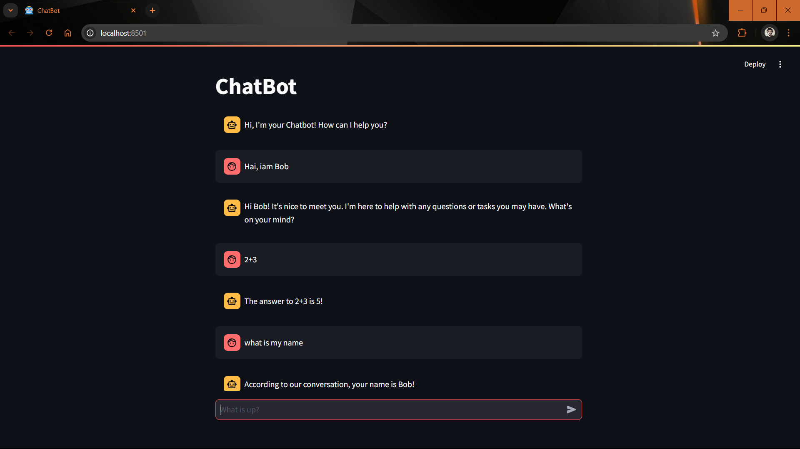

# LLM-powered chatbot 🤖
A conversational AI chatbot built with Streamlit, LangChain, and Language model (LLM). This chatbot maintains conversation context and provides natural language responses through a clean web interface.



### Features

- Interactive chat interface built with Streamlit
- Conversation memory to maintain context across messages
- Language model powered by Groq's LLama3-8b
- Error handling and logging
- Session management for multiple users
- Customizable language support
- Clean and intuitive user interface

## Installation
**1.Clone the repository:**
```bash
git clone https://github.com/vishnun0027/LLM-powered-chatbot.git
cd LLM-powered-chatbot
```
**2.Install the required dependencies:**
```bash
pip install -r requirements.txt
```
**3.Create a .env file in the project root and add your Groq API key:**
```bash
GROQ_API_KEY=your_api_key_here
```
## Usage
**1.Start the Streamlit server:**
```bash
streamlit run src/chatbot.py --server.port=8501 --server.address=0.0.0.0
```
**2.Open your web browser and navigate to http://localhost:8501**  

**3.Start chatting with the bot!**


